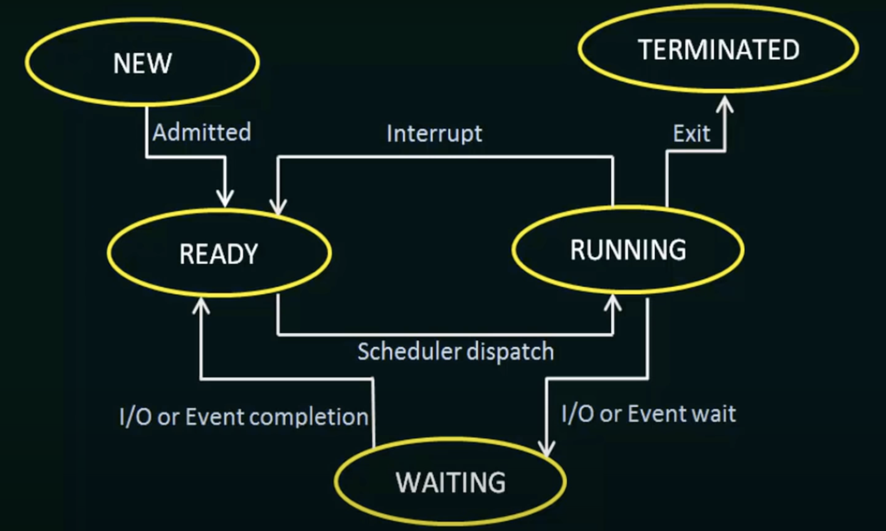

# Process Management

- Process: program in execution
- Thread: unit of execution within a process.

## Process states

- As a process executes, it changes state. The state of a process is defined in part by the current activity of that process.

