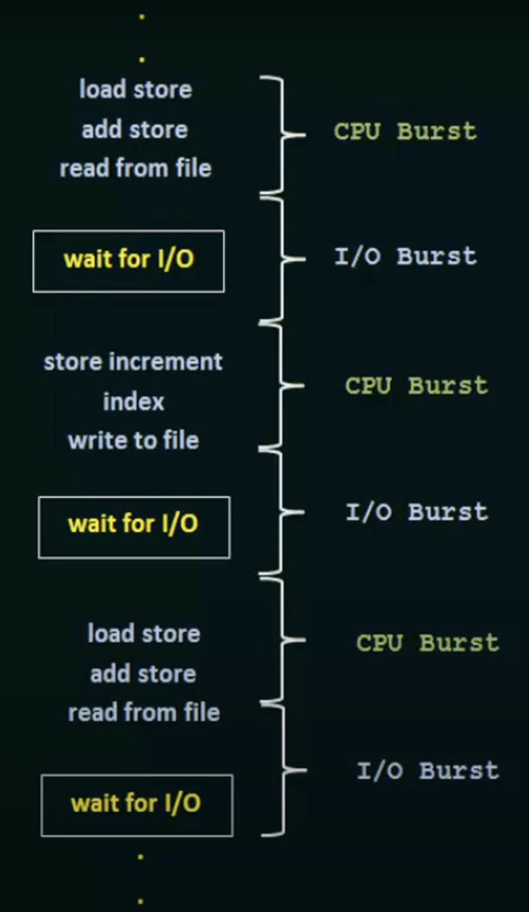

# CPU Scheduling

- CPU Scheduling is the process of assigning tasks to the CPU.
- There are two types of CPU scheduling:
    - Non-preemptive scheduling
    - Preemptive scheduling

## CPU and I/O Burst Cycles

- Process execution consists of cycle of `CPU execution` and `I/O wait`. Processes alternate b/w these two states.
    - CPU burst time is the time taken by the process to execute instructions.
    - I/O burst time is the time taken by the process to wait for I/O.
- Process starts with CPU burst followed by I/O burst followed by CPU burst and so on; finally terminated by CPU burst

    

## Preemptive / Non-preemptive Scheduling

- `CPU scheduler`: It assigns the CPU from READY queue to the process with the shortest CPU burst time.
- `Dispatcher`: It is the process that takes the control of CPU from the process and executes it.

CPU Scheduling takes place in the following cases:

1. When a process switches from `running` to `waiting` state. **[No choice]**
2. when a process switches from `running` to `ready` state. [choices are made during interrupt]
3. when a process switches from `waiting` to `ready` state. [choices are made during I/O completion]
4. when process terminates. **[No choice]**

- In preemptive scheduling, the process running on the CPU is suspended and the CPU scheduler is called to select another process to run.
- In non-preemptive/cooperative scheduling, once a process starts executing, it cannot be stopped until it completes its execution or voluntarily gives up control.

## Scheduling Criteria

- `CPU Utilisation`: CPU utilization is the percentage of time (0% - 100%) the CPU is busy.
- `Throughput`: Throughput is the number of processes that are completed during a given time period.
- `Turnaround Time`: It is the time taken by a process from the time it enters the ready queue to the time it completes its execution.
- `Waiting Time`: Waiting time is the time taken by a process from the time it enters the ready queue to the time it is assigned to the CPU.
- `Response Time`: Response time is the time taken by a process from the time it enters the ready queue to the time it is assigned to the CPU. (Example: slight delay after opening a application)

## First-Come, First-Served (FCFS) Scheduling

- It is the simplest non-preemptive CPU scheduling algorithm that requests the CPU for the process that arrives first.
- Implementation is managed by a FIFO queue data structure. `TAIL--[ ]--[ ]--[ ]--[ ]--HEAD`
- when a process enters ready queue, PCB is added to the tail of the queue.
- when a CPU is free, the first process in the queue is selected and assigned to the CPU.
- Average waiting time: LONG (depending upon the order of the arrival)
- `Limitation`: Allowing one process to run the CPU for an extended period.

## Shortest-Job-First (SJF) Scheduling

- It is the premptive or non-preemptive CPU scheduling algorithm that selects the process with the shortest next CPU burst time.
- If two processes have the same burst time, then the process with the lowest process number is selected.
- Average waiting time: SHORT 
- `Limitation`: difficulty in identifying the length of the next CPU burst time.

## Priority Scheduling

- It is the preemptive or non-preemptive CPU scheduling algorithm that selects the process with the highest priority.
- Equal priority processes are scheduled in a FCFS fashion.
- preemptive scheduling will preempt if the priority of the newly arrived process is higher than the currently running process.
- non-preemptive scheduling will append the process to the end of the queue.
- `Limitation`: Indefinite Blocking / Starvation, high-priority processes prevent lower-priority processes from running.
- `Solution`: Use Aging technique to increase the priority of the waiting process after every time slice. 

## Round Robin Scheduling

- It is a preemptive CPU scheduling algorithm (time sharing systems) that selects the process with the shortest CPU burst time and allocates the CPU for that process for a time interval called time quantum.
- `Time Quantum`: The time period during which the process will get a chance to execute on the CPU.
- The CPU scheduler goes around the ready queue, allocating the CPU to each process for a time interval of up to 1 time quantum until every process completes.
- `Limitation`: High Turnaround time, Inefficiency for I/O bound processes.