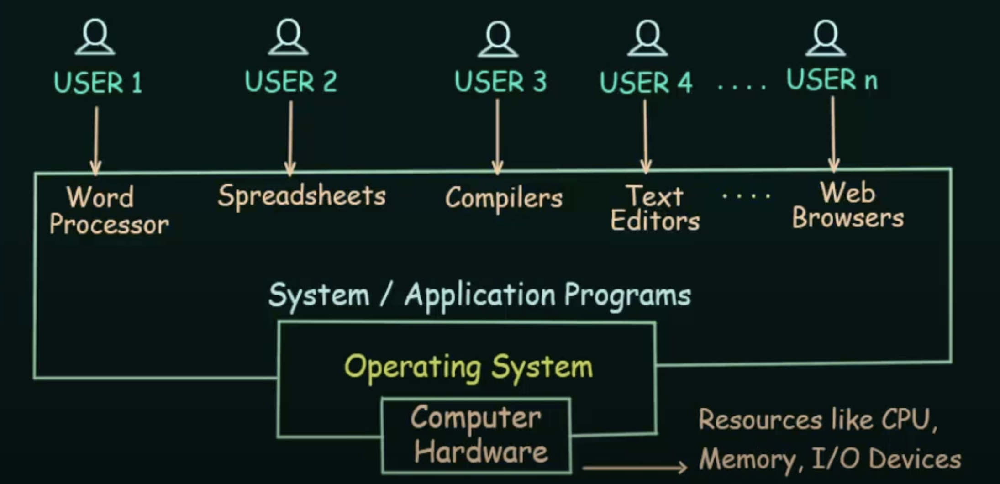
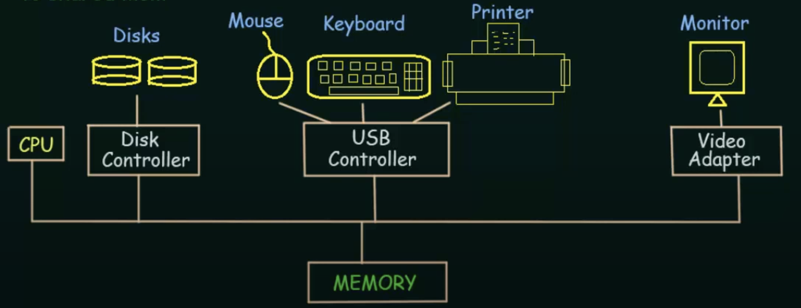
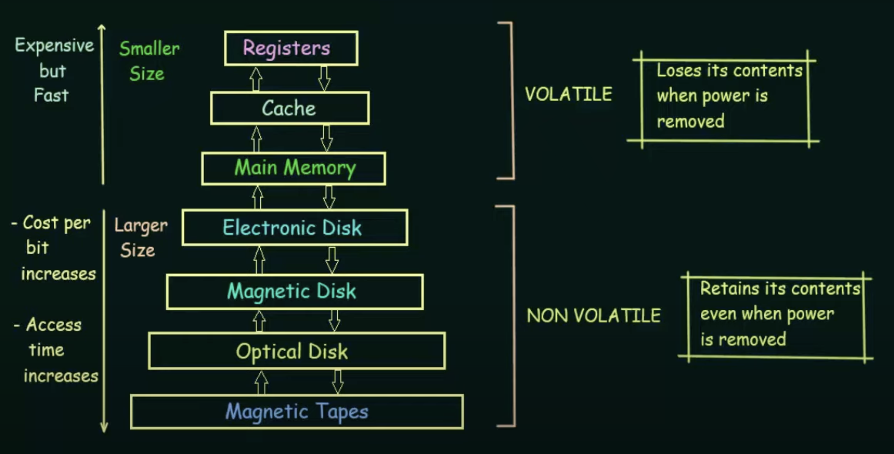
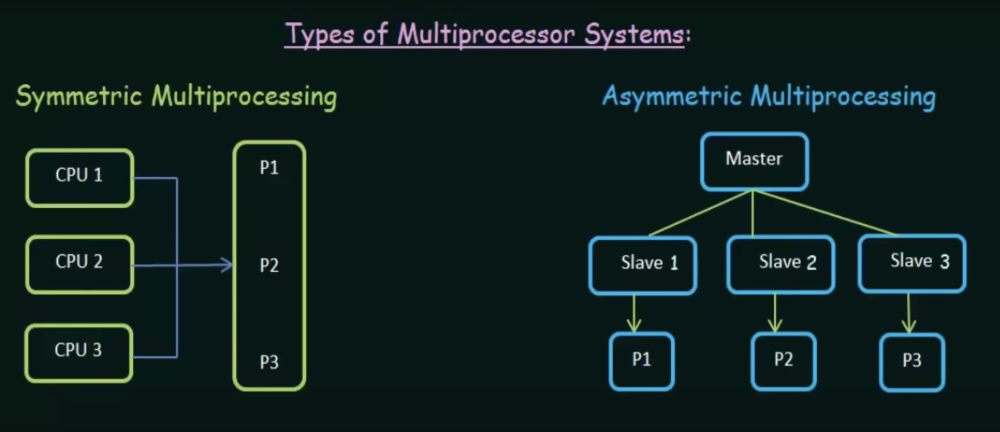
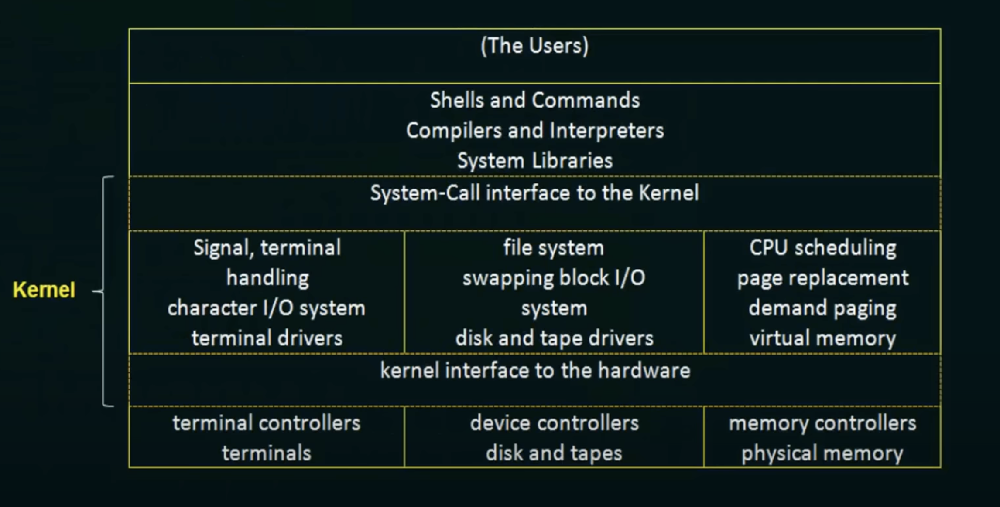
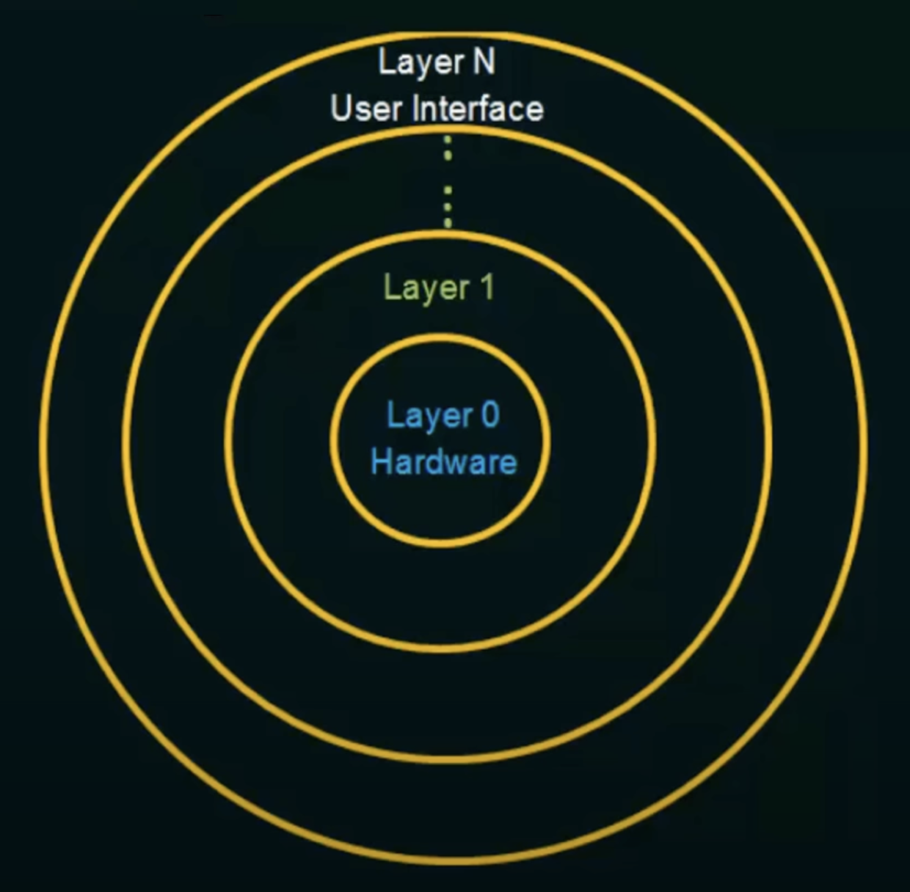
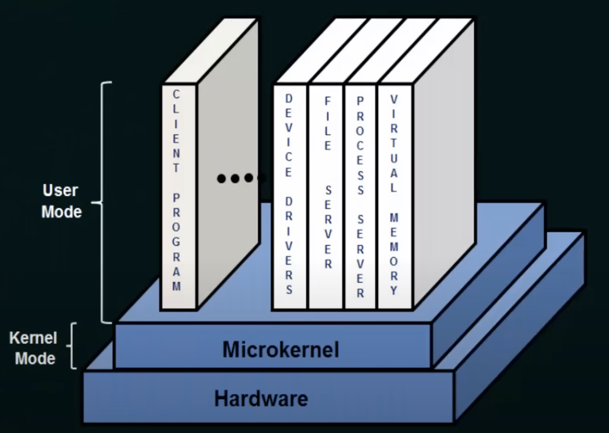
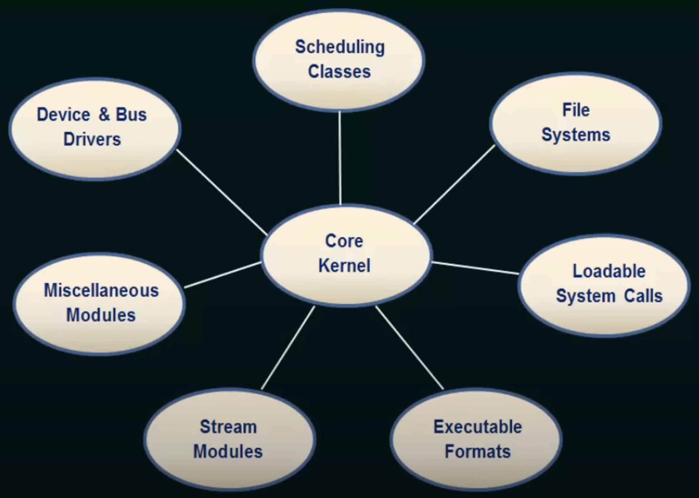

# Basics of Operating System

## Introduction

- program that manages the computer hardware.
- provides a base for application programs and acts as an intermediary between computer `user` and compter `hardware`.
- Examples: Windows, Linux, Mac OS, Android

    

    - Computer Hardware: Resources like CPU, Memory, I/O devices
    - Operating System: manages allocation of resources, memory, security
    - Programs (System / Application): perform tasks used directly by the users

### Types of OS

- Batch OS: Executes a sequence of jobs without user interaction.
- Time-sharing OS: Allows multiple users to interact with a computer simultaneously.
- Distributed OS: Manages resources across multiple interconnected computers.
- Network OS: Coordinates communication and resource sharing within a network.
- Real-Time OS: Provides predictable and timely responses for time-sensitive tasks.
- Multi-Programming/Processing/Tasking OS: Runs multiple programs concurrently for efficient resource utilization.

## Computer System Operation

  
  
  - CPU (Central Processing System): Brain of the Computer where computation and calculationg takes place
  - Hardware devices are connected to a `Controller` that takes care of device's I/O Operations
  - These CPU, adapters and controllers are connected by a common bus to a shared MEMORY. 
  - If program needs to be executed, It needs to be loaded to Main memory (finite)
  - CPU and the device controllers can execute concurrently, competing for memory cycles
  - To ensure orderly access to shared memory, a memory controller is provided to synchronize memory access

## Terminology

- **Bootstrap Program**: First program that runs when powered up or rebooted; stored in ROM to load OS Kernel to perform tasks.
- **Interrupt**: occurence of an event signalled by an Interrupt to the CPU via system bus from `Hardware` .
- **System Call**(Monitor call): `Software` may trigger an interrupt by executing a special operation called System Call.
- **Interrupt Service Routine**: contains the intended task to complete after a Interrupt

## Storage Structure

## I/O Structure

- `reliability` and `performance` of a system greatly depends on Input, output management
- Device controllers maintain
    - Local Buffer Storage
    - Set of Special Purpose Registers
- operating systems have a device driver for each device controller
- It presents a uniform interface to the device to the rest of the operating system

### Working Principle of I/O Operation

1. device driver loads the appropriate registers within the device controller
2. device controller examines the contents of these registers to determine what action to take
3. controller starts the transfer of data from the device to its local buffer
4. Once data transfer is complete, device controller informs device driver via an interrupt about completion
5. device driver then returns control to the operating system

`Problem`: This is only useful for small amount of data transfer and not for bulk data movement 
`Solution`: Direct Access Memory (DMA), device controller transfers entire datablock directly to/from its own buffer storage to memory, with no CPU intervention. 

## Operating System Structure

### Multiprogramming

- The objective of multiprogramming is to have some process running at all times, to maximize CPU utilization.
- Multiprogramming increases CPU utilization and throughput by organizing jobs so CPU always has one to execute.
- Multiple programs are loaded into the computer's memory simultaneously, and the CPU switches between them rapidly.

### Time-Sharing / Multitasking

- CPU executes multiple jobs by switching among them
- Switches occur so frequently that the users can interact with each program while it is running
- Time sharing requires an interactive GUI computer system that provides direct communication

## OS Services
1. User interface
2. Program Execution
3. I/O operations
4. File system manipulation
5. Communications
6. Error detection
7. Resource allocation
8. Accounting
9. Protection and Security

 ## System Calls

System calls provide an interface to the services made available by an Operating System.

- `User Mode`: No direct access to memory, hardware or resources
- `Kernel Mode`: (Privilege Mode) have direct communication to memory, hardware or resources

When user mode needs resources from memory or hardware, it makes a call (namely `System Call`) to OS and executes a context switching from User mode to Kernel mode.

> System call is the programmatic way in which a computer progran requests a service from the kernel of the operating system. These calls are generally available as service routines written in C and C++

### System Call Types

1. Process Control 

    
  - end/abort process
  
  - load/execute process
  
  - create/terminate process
  
  - get/set process attributes
  
  - wait for time, event, signal event
  
  - allocate/free memory

2. File Manipulation

    
  - create/delete file
  
  - open/close
  
  - read/write/reposition
  
  - get/set file attributes

3. Device Management

    
  - request/release device
  
  - read/write/reposition
  
  - get/set device attributes
  
  - logically attach/detach devices

4. Information Maintenance

  - get/set time or date

  - get/set system data

  - get process, file or device attributes

  - set process, file or device attributes

5. Communications

    
  - create/delete communication connection
  
  - send/receive messages
  
  - transfer status information
  
  - attach/detach remote devices

## OS Architectures

### Monolithic Structure

- the entire operating system kernel runs in a single address space.
- All kernel functions, device drivers, and system services are part of a single, large, and integrated executable.
- `Disadvantage`: Limited Scalability and Modularity

### Layered Structure

- OS is organized as a hierarchy of layers, each providing specific functionality.
- Each layer communicates with adjacent layers through well-defined interfaces.
- `Disadvantage`: Increased Complexity, modifications in one layer require adjustments in multiple layers

### Microkernel Structure

- It is kept minimal, and most of the traditional OS functions are implemented as user-space processes or servers.
- Communication between components is done through inter-process communication (IPC) and Message Passing Systems.
- `Disadvantage`: Performance Overhead

### Modular Structure

- Each protected Interface Modules will be dynamically loaded into core kernel when required 
- Flexible Communication between two modules via core kernels

## Virtual Machines

> The fundamental idea behind a virtual machine is to abstract the hardware of a single computer (the CPU, memory, disk drives, network interface cards, and so forth) into several different execution environments, thereby creating the illusion that each separate execution environment is running its own private computer.

- Virtual Machine Software - Runs in `Kernel` mode
- Virtual Machine - Runs in `User` Mode
- Each VM has its own virtual user mode and virtual kernel mode

## System Generation (SYSGEN)

- It is the process of creating a customized operating system image tailored to specific hardware configurations and software requirements.
- generates a system-specific version of the operating system that includes only the necessary components and configurations for a particular computer system
- Information such as number of CPUs, Memory and devices available

## System Boot

- procedure of starting a computer by loading the kernel is known as booting the system.
- small piece of code in ROM called bootstrap program or bootstrap loader locates the kernel
- Upon loading, it traverses the file system, locates the operating system kernel, loads it into memory, and initiates execution. 
- The system is said to be "RUNNING" at this point.