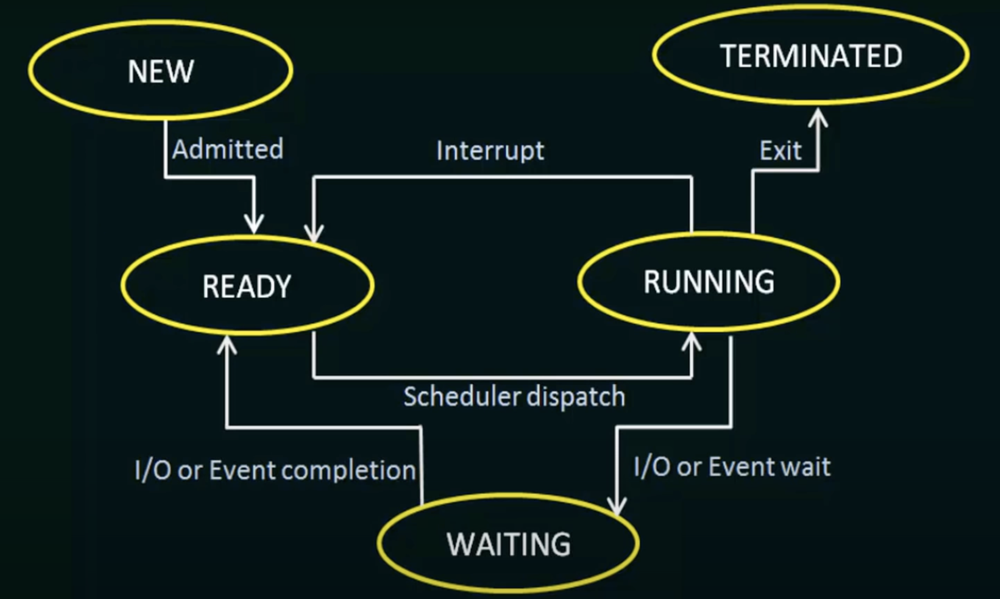

# Process Management

- Process: program in execution
- Thread: unit of execution within a process.

## Process states

- As a process executes, it changes state. The state of a process is defined in part by the current activity of that process.

## Process Control Block (PCB)

Each process is represented in the operating system by a Process Control Block (PCB) - also called a task control block.

1. **Process ID (PID):** Unique identifier assigned to distinguish different processes.

2. **Program Counter (PC):** Memory address of the next instruction to be executed.

3. **Register Set:** Collection of CPU registers storing the current state of the process.

4. **Process State:** Indicates the current state, such as "running," "ready," or "blocked."

5. **Memory Management Details:** Information about the process's memory usage, including base and limit registers or page tables.

6. **CPU Scheduling Information:** Data related to the process's position in the CPU scheduling queue, priority, or scheduling parameters.

7. **I/O Status:** Keeps track of I/O requests and status, including open files and pending I/O operations.

8. **Accounting Information:** Records resource usage statistics, execution time, and CPU time.

9. **Link to Next PCB:** Enables the creation of a linked list of PCBs for efficient management by the operating system.

## Process Scheduling

- **Job Queue** - As processes enter the system, they are put into a job queue, which consists of all processes in the system.
- **Ready Queue** - The processes that are residing in main memory and are ready and waiting to execute 

Job Queue -> Ready Queue -> CPU

1. completes the process and ends
2. if process with higher priority approached, existing running process will be moved to "partially executed swapped-out
processes" area
3. if running process needs I/O operation, it is moved to I/O waiting queues to get its turn.

## Context Switching

- Interrupts cause the operating system to change a CPU from its current task and to run a kernel routine.
- During an interrupt, the system must save the current process's context on the CPU to later restore it, effectively pausing and then resuming the process.
- Context-switch time is pure overhead, because the system does no useful work while switching.
- **Analogy**: Reading a book, bookmarking it, Resuming it later.

## Process Creation & Deletion

### Creation

- Process created using a system call called, `create-process`
- creating process - **parent** process
- new processes - **child/children**  process.

Two execution possibilities when parent process creates child process:

1. The parent continues to execute concurrently with its children.
2. The parent waits until some or all of its children have terminated.

Two address space possibilities when parent process creates child process:

1. The child process is a `duplicate` of the parent process
2. The child process has a new program loaded into it.

### Deletion

- A process terminates after executing its final statement and return using `exit()` system call.
- the process may return a status value (typically an integer)
- Resources (physical, virtual memory, open files, I/O buffers) are deallocated
- process can cause the termination of another process via an appropriate system call (parent -> child)
    - The child has exceeded its usage of some of the resources that it has been allocated.
    - The task assigned to the child is no longer required.
    - OS does not allow a child to continue if its parent terminates.

## Interprocess Communication

Processes executing concurrently in the operating system may be either `independent` or `cooperating` processes.

- Cooperating processes require an interprocess communication (IPC) mechanism that allows to exchange data.
- Two Types: `Shared Memory` and `Message Passing`
    - In the shared-memory model, information exchange takes plces in a common memory region through reading and writing data.
    - In the message passing model, communication takes place by messages exchanged through kernels.

### Shared Memory

- Shared-memory interprocess communication involves creating a shared-memory region. 
- It resides in the initiating process's address space, and other processes attach to it for communication. 
- Operating systems typically restrict direct access between processes, but shared memory requires mutual agreement to remove this restriction.

**Producer-Consumer** - A producer process produces information that is consumed by a consumer process.
- Analogy: 
    - `Compiler`(Producer) -> Compile code -> `Assembler`(Consumer)
    - `Assembler`(Producer) -> produce objects -> `Loader`(Consumer)
- **Problem**: conflicts between producers and consumers, especially when accessing a data.
- **Solution**: Shared Memory (Buffer Sharing, Synchronization)

- Types of Buffer:
    - `Unbounded` Buffer (No limit in Buffer size; producers can always produce items)
    - `Boundeed` Buffer (fixed Buffer size; producers wait if full; consumer wait if empty)

### Message Passing

- It is a mechanism to allow processes to communicate without shared address memory.
- It will be useful where communicating processes reside in different networks
- **Two Operations:** `Send` and `Receive` 
- **Size Type:** `Fixed` and `Variable`

- To communicate between processes, a process must first create a `communication link`. This can be implemented by three methods:
    - Direct or indirect communication (Naming System)
    - Synchronous or asynchronous communication
    - Automatic or explicit buffering

#### Direct Communication

- Each process that wants to communicate must explicitly name the recipient or sender of the communication.
- `Symmetric` Addressing: send (P, message) and receive (Q, message) [Both sender and recipient names are required]
- `Assymmetric` Addressing: send (P, message) and receive (variable_id, message) [recipient name is not required]

#### Indirect Communication

- The messages are sent to and received from mailboxes, or ports.
- A mailbox may be owned either by a process or by the operating system.
- Two processes can communicate only if the processes have a shared mailbox
    - send(A, message): Send a message to mailbox A.
    - receive (A, message): Receive a message from mailbox A.

#### Synchronous / Asynchronous Communication

- Blocking send: sending process is blocked until the message is received by the receiving process or by the mailbox.
- Non-blocking send: sending process sends the message and resumes operation.
- Blocking receive: receiving process is blocked until the message is sent by the sending process or by the mailbox.
- Non-blocking receive: receiving process receives the message or null and resumes operation.

#### Automatic / Explicit Buffering
- messages exchanged by communicating processes reside in a temporary queue.
- It can be implemented in 3 ways:
    - `Zero Capacity`: The buffer length is zero and the sender is blocked.
    - `Bounded Capacity`: The buffer length is N, and N messages can be queued. If Queue is full, sender is blocked
    - `Unbounded Capacity`: The buffer length is infinite and the sender is NEVER blocked.

## Remote Procedure Calls

- A remote procedure call (RPC) is a method of interprocess communication that allows a program to call a procedure or function in another address space.
- It uses a message-passing communication scheme to provide remote service.
- It allows a program to call a procedure or function in another address space.

#### Issues faced by RPC:

- Data Representations (Endianess in 32-bit / 64-bit). Solution: external data representation (XDR).
- Network Issue. Solution: 'Exactly Once' Functionality

## Threads

- Thread is a basic unit of CPU utilisation (thread ID, program counter, register set, stack)
- It shares code sections, data section, open files, open sockets with  other threads.\
- Benefits: Responsiveness, Resource Sharing, Economy, Multiprocessor Utilisation

- **Types:** `User` and `Kernel` Threads 
    - User Threads: managed without kernel support.
    - Kernel Threads: managed directly by the kernel.

- Relation b/w user & kernel threads
    - `Many-to-On`e: Many user threads map to one kernel thread. Limitation: Concurrency
    - `One-to-One`: One user thread maps to one kernel thread. Advantage: utilise multiprocessor resources.
    - `Many-to-Many`: Many user threads map to many kernel threads.

### HyperThreading / Simultaneous Multithreading (SMT)

- Hyperthreaded systems allow their processor cores' resources to become multiple logical processors for performance.
- It is a form of parallelism that allows multiple threads to run on a single core.

### Fork() and Exec() System Calls

- `Fork()`: creates a separate, duplicate process and returns a new process ID (PID) to the new process. 
- `Exec()`: creates a new process and replaces the current process with it.
 
